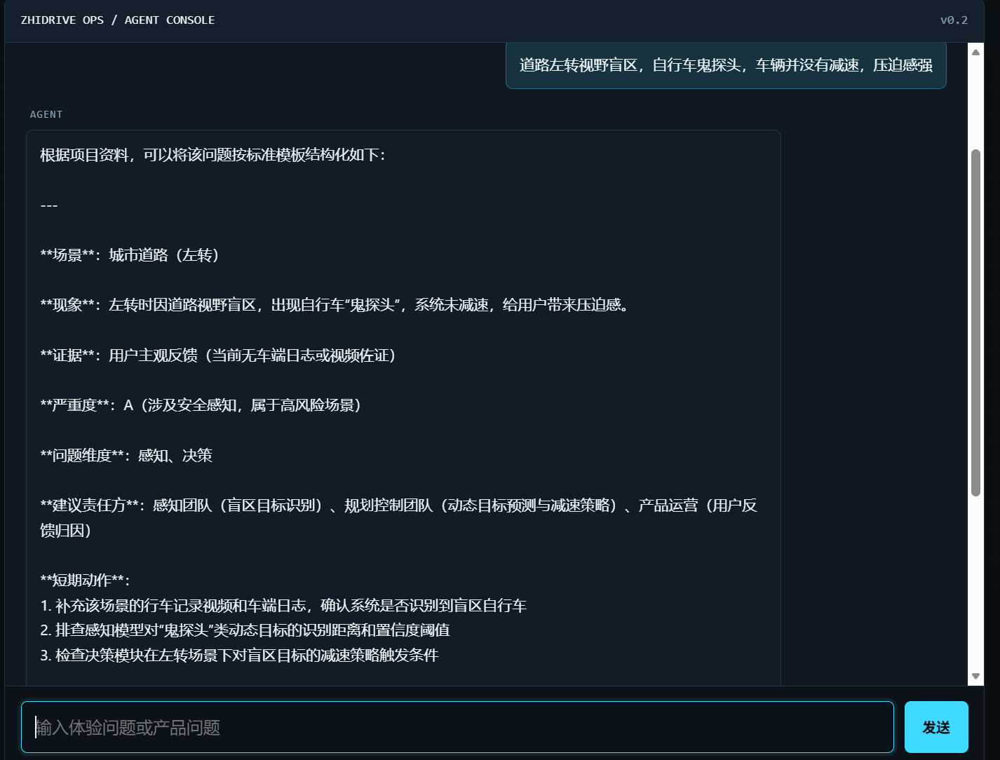

# 智驾运营 Agent

面向智能驾驶产品运营场景的个人 AI 产品运营实战项目。项目用 Agent + RAG，把自然语言体验反馈转化为可派发、可验证、可复盘的运营工单，解决智驾体验反馈运营效率低的问题。

## 项目背景

智驾产品运营中，NOA 体验反馈大量停留在“变道犹豫、NOA 降级、接管提醒晚”等主观描述。传统方式依赖人工判断问题属于感知、决策、交互、硬件还是场景边界，跨团队沟通成本高，问题闭环不完整。

**解决的核心问题：**

- 用户反馈过于主观，难以直接进入问题定位和研发排期。
- 问题责任方不明确，产品、研发、测试、硬件之间反复沟通。
- 运营指标不透明，难以判断问题优先级和处理效率。
- AI 工具更多被当作聊天助手，缺少面向运营流程的产品化落地。

**最终成果：**

从 0 到 1 完成智驾运营 Agent，支持场景评测、五维归因、问题闭环、RAG 知识库问答和运营增长看板，将自然语言反馈自动转化为结构化运营工单，沉淀 120+ 条问题案例和完整项目复盘。

## 项目亮点

### 产品思维

从真实运营痛点出发，设计感知、决策、交互、硬件适配、场景边界五维归因模型，并定义问题闭环流程。每个问题不只输出“结论”，还输出场景、严重度、问题维度、建议责任方、短期动作、验证方式和复盘标准。

### 技术落地

独立完成从 Agent 逻辑、RAG 知识库到前后端看板的全栈实现。使用 LangChain、LangGraph、FastAPI、ChromaDB 和 sentence-transformers，搭建结构化输出、语义检索和运营数据看板。

### 实战导向

覆盖运营全链路：反馈接入、分析归因、工单派发、效果复盘。项目不只展示技术能力，更体现 AI 产品运营中的用户调研、指标体系、活动触达和跨团队协同。

## 核心模块

### 场景评测

解决运营中“反馈场景不统一，问题无法对比”的痛点。项目建立城市道路、高速、变道、跟车、避障、泊车等高频场景标签，让每条反馈进入统一场景体系。

### 五维归因

解决“反馈只描述现象，找不到责任方”的痛点。项目将问题归入感知、决策、交互、硬件适配、场景边界五个维度，并输出建议责任方和验证方式。

### 问题闭环

解决“问题提报后缺乏跟进标准”的痛点。每条问题包含短期动作、验证方式和复盘结论，推动问题从发现到关闭形成闭环。

### RAG 知识库问答

解决“运营知识分散，重复回答相同问题”的痛点。通过 ChromaDB、sentence-transformers、BM25 和 RRF 混合检索，让 Agent 基于项目知识库和历史案例回答，而不是凭空生成。

### 运营增长看板

解决“只有案例，没有运营效果衡量”的痛点。看板展示反馈处理量、闭环率、平均闭环时长、用户分层、活动触达和内容互动等运营指标。

## 项目截图

### 官网首页


项目官网承担产品价值表达和入口导航，将复杂的运营流程转化为清晰的产品介绍。

### 运营增长看板


从反馈漏斗、用户分层、活动实验到内容触达，集中展示产品运营全链路效果。

### 案例库与 RAG 检索


左侧为可筛选问题案例库，右侧为 RAG 检索结果，体现数据运营与知识库问答的结合。

### AI 运营控制台


模拟智驾运营控制台，展示场景评测流水线、五维归因和检索置信度。

### Agent 反馈解析示例



当用户输入“道路左转视野盲区，自行车鬼探头，车辆并没有减速，压迫感强”时，Agent 自动解析出场景、现象、证据、严重度、问题维度和责任方，并给出可执行短期动作。

## 核心功能

- 自然语言反馈结构化解析
- 五维问题归因
- 问题闭环与复盘
- RAG 知识库问答
- 案例库与评估集
- 运营指标看板
- 用户分层与活动分析
- 内容触达数据沉淀

## 技术栈

- Python
- FastAPI
- LangChain / LangGraph
- ChromaDB
- sentence-transformers
- SQLAlchemy
- DeepSeek / OpenAI
- Docker / Nginx

## 目录结构

```text
.
├── backend/       # Python 后端与 Agent 逻辑
├── website/       # 官网与运营看板
├── product/       # Agent Demo 页面
├── docs/          # 项目文档与截图
├── data/          # 案例、用户分层、活动与知识库数据
├── tests/         # pytest 测试
└── deploy/        # Docker、Nginx 部署配置
```

## 运行方式

```powershell
cd zhidrive-ops-agent

python -m venv .venv
.\.venv\Scripts\Activate.ps1
pip install -r requirements.txt
python -m backend.fastapi_app
```

访问：

`http://127.0.0.1:8766/website/index.html`

运行测试：

```powershell
python -m pytest
```

Docker 运行：

```powershell
docker compose -f deploy/docker-compose.yml up --build
```

## 环境变量

在项目根目录创建 `.env.local`：

```env
DEEPSEEK_API_KEY=your-key
DEEPSEEK_MODEL=deepseek-chat
```

也可以使用 OpenAI：

```env
OPENAI_API_KEY=your-key
OPENAI_MODEL=gpt-4.1-mini
```

不要将 API Key 提交到 Git。

## 项目沉淀与思考

AI Agent 在产品运营中的价值，不只是“会聊天”，而是能把分散的用户反馈、运营知识和工作流程，转化为结构化的运营资产。

这个项目让我理解到：好的 AI 产品运营方案，需要先定义业务问题，再设计归因和闭环标准，最后用 Agent 与 RAG 把这些流程自动化。技术是手段，真正的产品价值在于让反馈更可定位、让问题更可派发、让运营效果更可衡量。

## 项目边界

本项目是个人 AI 产品运营实战项目，不包含博世内部数据，不公开未确认的车型缺陷，不把行业趋势写成个人实测结论。
