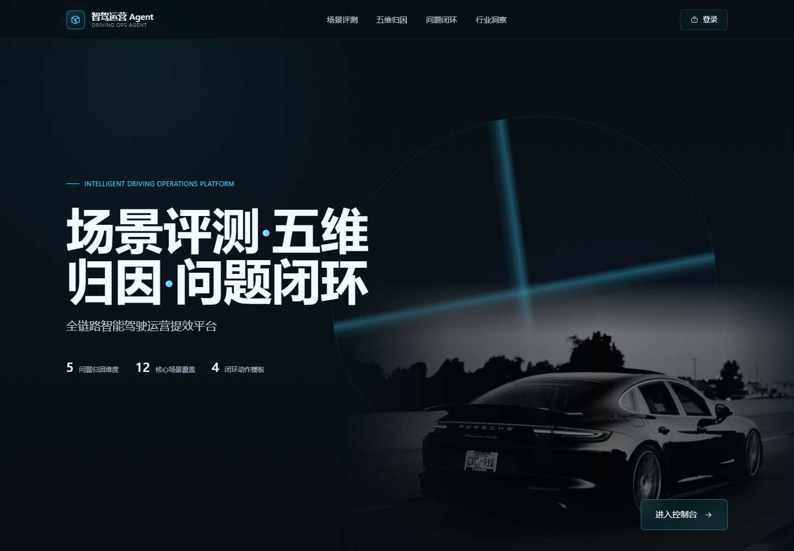
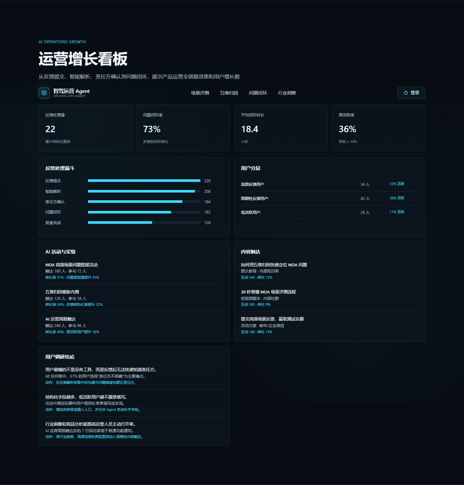
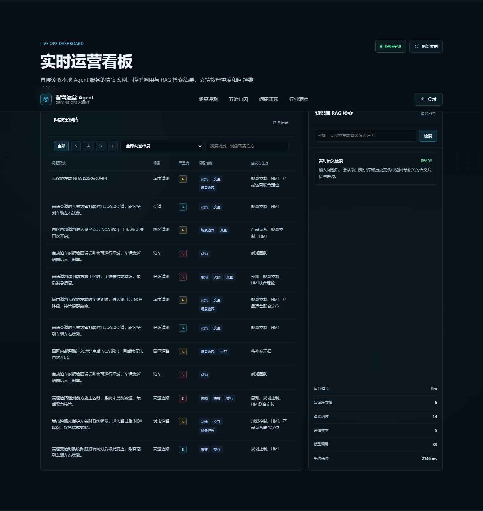
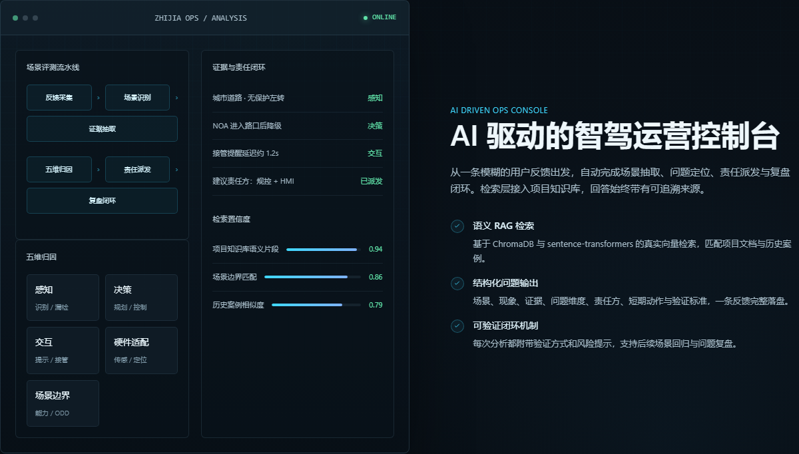

# 智驾运营 Agent

面向智能驾驶产品运营场景的 AI 产品运营实战项目，将自然语言体验反馈转化为可派发、可验证、可复盘的运营工单。

## 项目背景

智驾产品运营中，大量 NOA 体验反馈仍停留在“变道犹豫、NOA 降级、接管提醒晚”等主观描述。问题定位依赖人工归因，产品、研发、测试、硬件之间的协同成本较高，闭环不完整。

本项目通过 Agent、RAG 和结构化运营流程，把模糊反馈自动转化为场景、严重度、问题维度、责任方、短期动作和验证方式。

## 项目截图

### 官网首页



### 运营增长看板



### 案例库与 RAG 检索



### AI 运营控制台



## 核心能力

- 场景评测：覆盖城市道路、高速、变道、泊车、环岛等高频场景。
- 五维归因：感知、决策、交互、硬件适配、场景边界。
- 问题闭环：责任方、短期动作、验证方式、复盘结论。
- RAG 知识库：ChromaDB、sentence-transformers、BM25、RRF 混合检索。
- 运营增长看板：反馈处理漏斗、用户分层、活动触达、内容互动。
- Agent 工作流：LangChain、LangGraph、结构化输出与流式响应。

## 技术栈

- Python
- FastAPI
- LangChain / LangGraph
- ChromaDB
- sentence-transformers
- SQLAlchemy
- DeepSeek / OpenAI
- Docker / Nginx

## 目录结构

```text
.
├── backend/       # Python 后端与 Agent 逻辑
├── website/       # 官网与运营看板
├── product/       # Agent Demo 页面
├── docs/          # 项目文档与截图
├── data/          # 案例、用户分层、活动与知识库数据
├── tests/         # pytest 测试
└── deploy/        # Docker、Nginx 部署配置
```

## 快速运行

```powershell
cd zhidrive-ops-agent

python -m venv .venv
.\.venv\Scripts\Activate.ps1
pip install -r requirements.txt
python -m backend.fastapi_app
```

访问：

`http://127.0.0.1:8766/website/index.html`

## 运行测试

```powershell
python -m pytest
```

## Docker 运行

```powershell
docker compose -f deploy/docker-compose.yml up --build
```

## 环境变量

在项目根目录创建 `.env.local`：

```env
DEEPSEEK_API_KEY=your-key
DEEPSEEK_MODEL=deepseek-chat
```

也可以使用 OpenAI：

```env
OPENAI_API_KEY=your-key
OPENAI_MODEL=gpt-4.1-mini
```

不要将 API Key 提交到 Git。

## 项目边界

本项目是个人 AI 产品运营实战项目，不包含博世内部数据，不公开未确认的车型缺陷，不把行业趋势写成个人实测结论。
